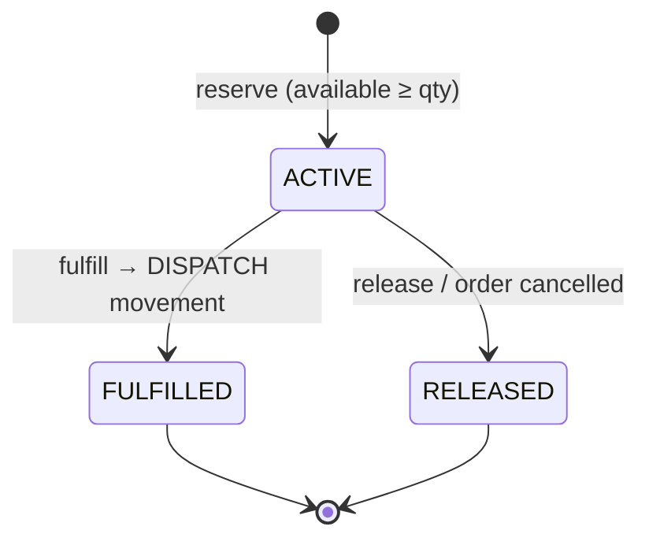
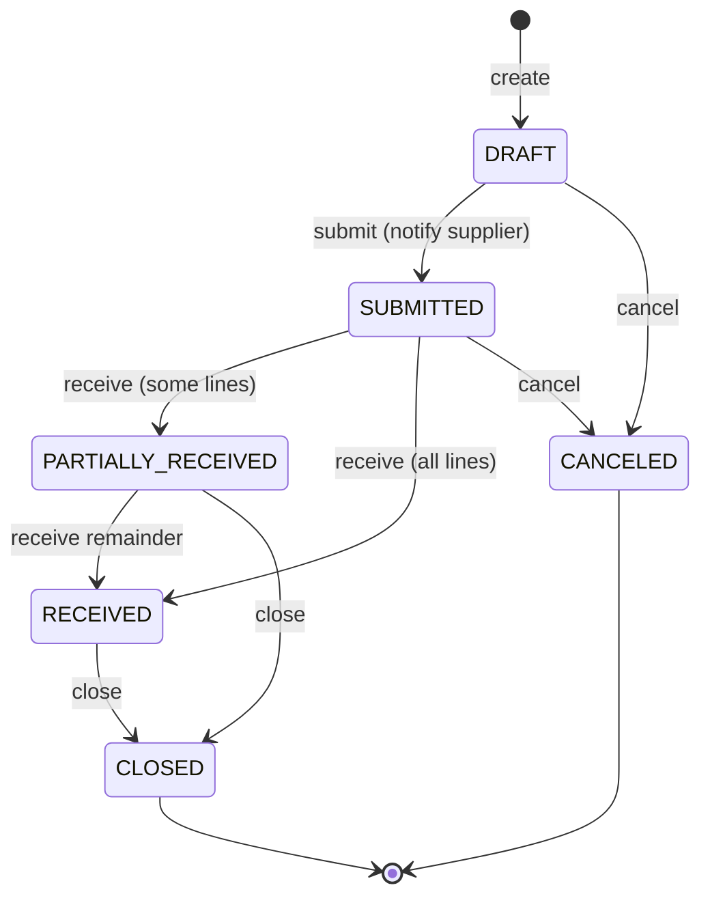
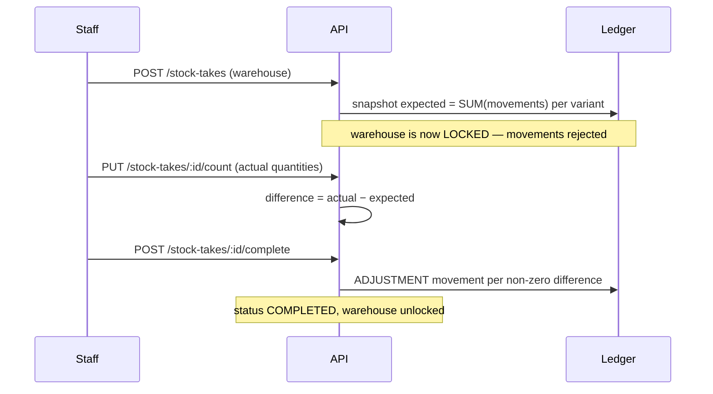

# Inventory Management API

A production-grade inventory and stock-management API for retail, e-commerce and
manufacturing: product catalog with variants, multi-warehouse stock, an
append-only stock-movement ledger, purchase-order lifecycle, batch/lot tracking
with expiry, stock reservations, FIFO / weighted-average valuation, stock-take
audits, low-stock & expiry alerts, and Excel reporting.

**Stack:** Node.js 20 · NestJS 10 · TypeScript 5 · Prisma (PostgreSQL) · Redis ·
BullMQ · Socket.IO · ExcelJS · Jest · Docker.

---

## The one rule that shapes everything

> **Stock quantities are never stored as a mutable number. Every change is a
> `StockMovement` row, and current stock is the SUM of those rows.**

```
physical stock (variant, warehouse) = Σ StockMovement.quantity
reserved stock                      = Σ Reservation.quantity where status = ACTIVE
available stock                     = physical − reserved
```

This makes the ledger fully auditable — you can reconstruct stock at any point in
time — and it means there is exactly one place that mutates stock: `StockService`.
Nothing else writes to `stock_movements`. Purchase-order receipts, transfers and
stock-take adjustments all call into it.

### Movement types and their sign

| Type           | Sign | Raised by                          |
| -------------- | :--: | ---------------------------------- |
| `RECEIVE`      |  +   | goods in (PO receipt, manual)      |
| `RETURN`       |  +   | customer return                    |
| `TRANSFER_IN`  |  +   | destination side of a transfer     |
| `DISPATCH`     |  −   | goods out / reservation fulfilment |
| `TRANSFER_OUT` |  −   | source side of a transfer          |
| `ADJUSTMENT`   | +/−  | stock-take correction / manual     |

---

## Stock movement flow

```mermaid
flowchart TD
    subgraph Inbound
      PO[Purchase Order receive] -->|RECEIVE +| L[(stock_movements ledger)]
      RET[Customer return] -->|RETURN +| L
      ADJp[Adjustment +] --> L
    end
    subgraph Outbound
      SO[Sales order] -->|reserve| R[(reservations)]
      R -->|fulfil| L2[DISPATCH −]
      L2 --> L
      DIS[Direct dispatch] -->|DISPATCH −| L
      ADJm[Adjustment −] --> L
    end
    subgraph Transfer
      T[Transfer] -->|TRANSFER_OUT −| L
      T -->|TRANSFER_IN +| L
    end
    L --> Q{{"SUM(quantity)"}}
    Q --> LV[Current stock level]
    R --> AV["available = physical − reserved"]
    LV --> AV
```



## Reservation lifecycle



Reservations reduce **available** stock without touching physical stock, so two
orders can't claim the same unit. Reserve, dispatch, and transfer run in
`Serializable` transactions to prevent overselling under concurrency.

## Purchase-order lifecycle



Receiving a PO creates `RECEIVE` movements (`referenceType = PO`) carrying the
line's `unitPrice` as `unitCost` — that cost is what valuation later reads.

## Stock-take (audit) workflow



While a stock take is `IN_PROGRESS`, `StockService` rejects any movement for that
warehouse so counts are taken against a frozen picture.

---

## Stock valuation

Set per product via `valuationMethod`:

- **Weighted average** — `Σ(qty × unitCost) / Σ(qty)` over inbound movements that
  carry a cost. Simple, smooth, order-independent.
- **FIFO** — inbound movements form cost *layers* oldest-first; outbound quantity
  consumes the oldest layers, and the quantity on hand is valued against the
  surviving layers. Reflects actual purchase-price history.

The valuation report groups by category and warehouse with subtotals and a grand
total, and is exportable to Excel.

---

## Getting started

### With Docker (recommended)

```bash
cp .env.example .env
docker compose up --build
# API      → http://localhost:3000/api/v1
# Swagger  → http://localhost:3000/api/v1/docs
# pgAdmin  → http://localhost:5050  (admin@inventory.local / admin)
```

The `api` service runs `prisma migrate deploy` on start; `bullmq-worker` runs the
alert/expiry jobs.

### Local development

```bash
npm install
cp .env.example .env                # point DATABASE_URL / REDIS_* at your services
npx prisma migrate dev --name init  # create schema
npm run prisma:seed                 # optional demo data
npm run start:dev                   # API with watch
npm run worker:dev                  # BullMQ worker (separate terminal)
```

### Tests

```bash
npm test           # unit tests
npm run test:cov   # with coverage (stock, valuation and reservation logic)
```

---

## Background jobs (BullMQ)

| Job               | Schedule             | Effect                                        |
| ----------------- | -------------------- | --------------------------------------------- |
| `low-stock-scan`  | hourly (`LOW_STOCK_CRON`) | raise `LOW_STOCK` alerts, auto-resolve recovered ones |
| `expiry-scan`     | daily (`EXPIRY_CRON`)     | raise `EXPIRING_BATCH` alerts within threshold |

Alerts are pushed live to admin dashboards over Socket.IO (`alert` event). Both
scans can also be triggered on demand via `POST /alerts/scan/*`.

---

## API reference

Base path: `/api/v1`. Full interactive docs at `/api/v1/docs`.

### Products & catalog
| Method | Path | Description |
| --- | --- | --- |
| POST | `/products` | Create product (SKU auto-generated `PRD-XXXXX`) |
| GET | `/products` | List / search (name, sku, barcode, category) |
| GET | `/products/:id` | Product with variants |
| PUT | `/products/:id` | Update |
| DELETE | `/products/:id` | Soft delete |
| POST | `/products/:id/variants` | Add variant |
| GET/POST/PUT/DELETE | `/categories` | Hierarchical categories |

### Warehouses & stock
| Method | Path | Description |
| --- | --- | --- |
| GET/POST | `/warehouses` | List / create |
| GET | `/stock` | Stock levels (filter by product, warehouse, below-reorder, zero) |
| POST | `/stock/receive` | Goods in |
| POST | `/stock/dispatch` | Goods out (optional FEFO) |
| POST | `/stock/transfer` | Inter-warehouse transfer |
| POST | `/stock/adjust` | Count correction |
| POST | `/stock/reserve` | Reserve stock |
| POST | `/stock/release` | Release reservation |
| POST | `/stock/fulfill` | Fulfil reservation → dispatch |
| GET | `/stock/movements` | Movement history (cursor-paginated) |

### Purchase orders & suppliers
| Method | Path | Description |
| --- | --- | --- |
| POST/GET | `/purchase-orders` | Create / list |
| GET/PUT | `/purchase-orders/:id` | Detail / update (draft only) |
| POST | `/purchase-orders/:id/submit` | Submit to supplier |
| POST | `/purchase-orders/:id/receive` | Receive goods |
| PUT | `/purchase-orders/:id/close` | Close |
| GET/POST | `/suppliers` | List / create |
| POST | `/suppliers/:id/products` | Link preferred product |
| GET | `/suppliers/:id/performance` | On-time delivery rate |

### Batches, stock takes, alerts, reports
| Method | Path | Description |
| --- | --- | --- |
| GET | `/batches` · `/batches/expiring` · `/batches/fefo/suggest` | Lot tracking |
| POST | `/stock-takes` | Start audit |
| PUT | `/stock-takes/:id/count` | Record counts |
| POST | `/stock-takes/:id/complete` | Apply adjustments |
| GET | `/alerts` | Active alerts |
| PUT | `/alerts/:id/acknowledge` · `/alerts/:id/resolve` | Alert workflow |
| GET | `/reports/stock-valuation` · `/reports/movement-summary` · `/reports/low-stock` · `/reports/expiring-batches` | JSON reports |
| GET | `/reports/export?type=...` | Excel (.xlsx) download |

---

## Project structure

```
src/
├── common/            # filters, interceptors, pagination, SKU utils
├── config/            # configuration + queue constants
├── prisma/            # PrismaService (global module)
├── redis/             # ioredis client (global module)
├── queue/             # BullMQ queue + repeatable job registration
├── modules/
│   ├── stock/         # StockService — the ledger core (all stock flows through it)
│   ├── products/      # products, variants, categories
│   ├── warehouses/
│   ├── suppliers/     # suppliers, preferred products, performance
│   ├── purchase-orders/
│   ├── batches/       # lot tracking, FEFO, expiry
│   ├── stock-takes/   # audit workflow
│   ├── alerts/        # service, WebSocket gateway, BullMQ processors
│   └── reports/       # valuation (FIFO / weighted avg), Excel export
├── main.ts            # HTTP API entrypoint
└── worker.ts          # BullMQ worker entrypoint
```

## License

MIT.
